<!-- ========================================================= -->

<!--                    AINJANA JOMON                          -->

<!--                  GitHub Profile README                    -->

<!-- ========================================================= -->
<div align="center">


</div>


# 👋 Hey, I'm Ainjana Jomon

### 💻 Developer • 🎓 CS Engineering Student • 🚀 Builder

<p align="center">
  <a href="https://github.com/ainjana">
    
  </a>
  <a href="https://github.com/ainjana?tab=repositories">
    
  </a>
  <a href="https://github.com/ainjana">
    
  </a>
</p>

<p align="center">
  <a href="https://github.com/ainjana">
    
  </a>
  <a href="https://www.linkedin.com/in/ainjana-jomon-78307837b">
    
  </a>
  <a href="mailto:ainjanajomon@gmail.com">
    
  </a>
</p>

</div>


## 🧑‍💻 About Me

- 🔭 I'm interested in **Web Development & Software Development**
- 🌱 Currently learning and improving my **programming skills**
- 💡 I enjoy building projects that solve real-world problems
- 🎯 Always exploring new technologies and tools
- 🚀 Passionate about learning, creating and experimenting
- 📚 Constantly improving my development workflow

---

## 🛠️ Tech Stack

<div align="center">

### 👨‍💻 Languages


### ⚛️ Frameworks & Libraries


### 🗄️ Databases & Tools


</div>

---

## 🚀 Featured Projects

<div align="center">

<table>
<tr>

<td width="50%" valign="top">

### 🎓 College Hub

A college-focused platform designed to bring useful college resources and functionality together.

<a href="https://github.com/ainjana/college_hub">

</a>

</td>

<td width="50%" valign="top">

### 🏫 Uni Hub

A university-focused project built to provide useful features and resources in one place.

<a href="https://github.com/ainjana/uni-hub">

</a>

</td>

</tr>

<tr>

<td width="50%" valign="top">

### ⏳ Event Countdown Timer

A simple and interactive countdown project for events.

<a href="https://github.com/ainjana/Event-countdown-timer">

</a>

</td>

<td width="50%" valign="top">

### 🤖 Hackathon Oral AI

An AI-focused project created as part of a hackathon project.

<a href="https://github.com/ainjana/Hackathon-Oral-Ai">

</a>

</td>

</tr>
</table>

</div>

---

# 📊 GitHub Analytics

<h2 align="center">📊 GitHub Statistics</h2>

<div align="center">





</div>

# 🔥 Contribution Streak

<div align="center">


</div>

---

# 📈 Contribution Activity

<div align="center">


</div>

---

# 🏆 GitHub Achievements

<div align="center">


</div>

---

# 📌 GitHub Overview

<div align="center">

<a href="https://github.com/ainjana">


</a>

</div>

---

## 📚 What I'm Learning

```text
Web Development       ███████████████████░░   90%
JavaScript            █████████████████░░░░   80%
Python                ████████████████░░░░░   75%
React                 ██████████████░░░░░░░   70%
Backend Development   ████████████░░░░░░░░░   60%
AI / ML               ██████████░░░░░░░░░░░   50%


